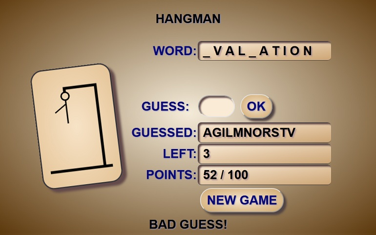

# Hangman-Game
Classical Hangman Game written in HTML, CSS, JS

# Features:
* Word for quessing
* Inputfield with 'Submit'(OK) button
* 'Enter' key keypress(as submit) to play the game
* Guessed characters in alphabetical order
* Number of possible wrong quesses left
* Points calculation system(max 100 points)
* 'New Game' button
* Hidden(at the beginning) 'Solution' field with button 
* When game is lost, guessing input will be removed from UI
* Rotating and color changing canvas with hangman drawing

# Calculating points:
* Maximum for the game is 100 points.
* Minimum can be 0 points(calculation will never go below 0 points).
* At the beginning of the game every right letter is worth 10 points.
* Every wrong letter devaluates the 10 points value for the right letters by 1 point and 1 point will be removed from total count.
* By selecting a letter that is already selected, 2 points will be removed from total.
* If player can't guess the word on total moves, the final points count will be divided by 2.

# GOOD LUCK !
